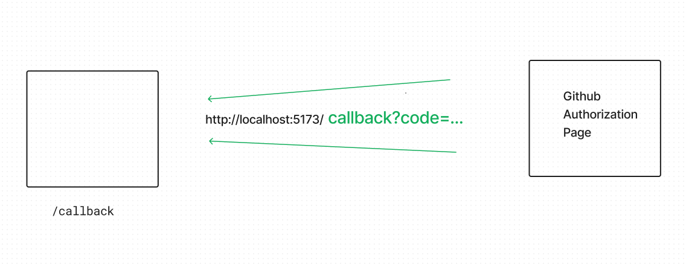
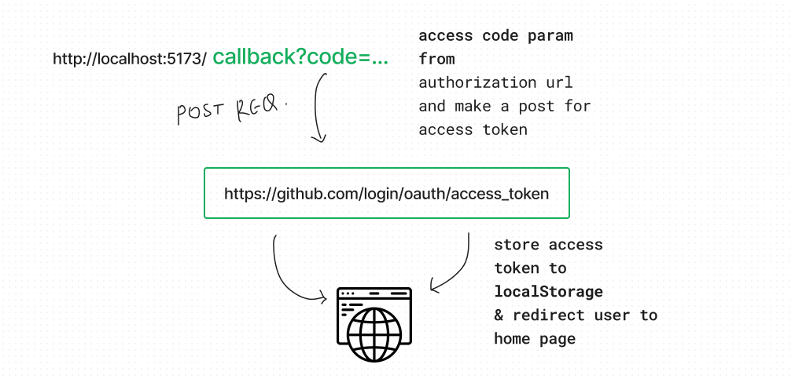

# GitHub OAuth 2.0 Authorization with React

GitHub supports **OAuth 2.0**, which is an industry-standard protocol for authorization. It allows users to **grant third-party** applications limited access to their GitHub accounts without sharing their passwords. **OAuth 2.0** is commonly used for secure and controlled API access and authentication

## 1. Redirecting Users for GitHub Identity Verification


## Authentication

Authentication is the process of verifying the identity of a user. In the context of GitHub OAuth 2.0, it involves the following steps:

1. The user initiates the authentication process by clicking a "Login with GitHub" button in your React app.
2. Your app redirects the user to the GitHub authorization page.
3. The user enters their GitHub credentials (if not already logged in).
4. GitHub validates the user's identity and prompts them to grant permissions to your app.
5. Once the user grants permissions, GitHub redirects them back to your app with an authorization code.

## Authorization

Authorization, in the context of GitHub OAuth 2.0, is the process of granting limited access to a user's GitHub account to a third-party application. After authentication, the user is asked to grant specific permissions (scope) to your app, such as read-only access to their repositories

### Implementation Steps

To implement GitHub OAuth 2.0 authorization in your React app, follow these steps:

1. Register your application on GitHub to obtain a `client_id`.

2. Construct the GitHub authorization URL in your React app, using the `client_id` and specifying the desired `scope`. For example:
   ```javascript
   const githubAuthUrl = `https://github.com/login/oauth/authorize?client_id=YOUR_CLIENT_ID&scope=repo,user`;
   ```

## 2. User is Redirected Back to React Application

After the user clicks the "Authorize" button on GitHub's authorization page, they are redirected back to your React application. This step is crucial to complete the authentication process and obtain the authorization code.



Once you have obtained the authorization code from the GitHub OAuth 2.0 flow, you can use it to make a secure POST request to GitHub's token endpoint. This POST request is a crucial step in the process, as it allows your application to exchange the authorization code for an access token



## 3. Use the access token to access the Github info of user on their behalf

Using the obtained access token, your application can access a user's GitHub information on their behalf. This allows your application to retrieve data from the user's GitHub account, such as their repositories, profile details, and activity, while ensuring secure and authorized access to their information
